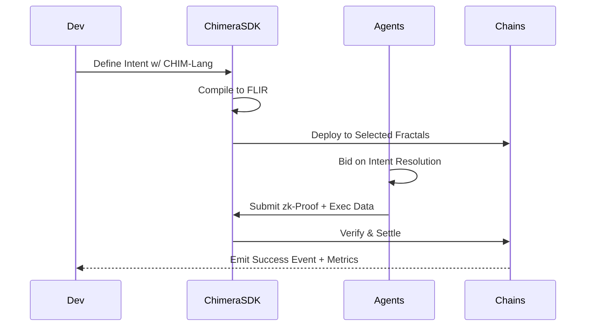

Apresento um framework completo para o **Chimera SDK** com infraestrutura técnica e componentes críticos para implementação real:

---

### **Chimera Full-Stack SDK Architecture**

#### **1. Core Components Layer**
1. **Cross-Chain Intent DSL** (CHIM-Lang)  
   - Gramática formal baseada em Rust + Cairo  
   - Expressividade para:  
     ```rust
     intent YieldFarming { 
         target: Portfolio ROI ≥ 15% APY,
         constraints: [MaxDrawdown < 5%, Dexes = {UniswapV3, CurveFi, PancakeSwap}],
         preferences: [MEV_Resistant, CarbonNeutral],
         expiration: BlockHeight + 5000
     }
     ```
   - Compilador para FLIR (Fractal Intermediate Representation)

2. **zk-Agent Development Kit**
   - Proving Runtime Environments:  
     - CPU: RISC Zero Bonsai  
     - GPU: CUDA-Plonk (NVIDIA Container)  
     - ASIC: HALO2 Circuit Template Engine  
   - zkML Libraries:  
     - PyTorch → ezkl Transpiler  
     - TensorFlow ZKP Op Library  
   - Agent Reputation SDK:  
     ```python
     class AgentReputation:
         def update(self, gas_efficiency: float, proof_time: float, accuracy: float):
             self.score = 0.4*accuracy + 0.3*(1/gas_efficiency) + 0.2*(1/proof_time)
     ```

#### **2. Cross-Chain Infrastructure**
1. **Fractal Connector Protocol**
   - Padrões de interoperabilidade:  
     - Ethereum → CosmWasm Bridge (IBC++ Spec)  
     - Polkadot ↔ Solana Light Client  
   - Módulos Pré-Construídos:  
     ```typescript
     import {CrossChainSwaps, AtomicArbitrage} from "@chimera/interchain";
     ```

2. **zk-IBC Implementation**
   - Grupos de prover para:  
     - FastFinality Chains (≤2s)  
     - High-Latency Nets (IoT/DePIN)  
   - Custo Otimizado:  
     ```
     HeaderProofCost = 0.001 * log(N_validators)
     ```

#### **3. Agent Marketplace Toolkit**
1. **Solver Engine Framework**
   - Auction Systems:  
     - Vickrey–Clarke–Groves (Truthful Bidding)  
     - Batch Auction Scheduler  
   - Template Matching Algorithm:  
     ```python
     def match_intent(intent: Intent, agents: List[zkAgent]):
         return sorted(agents, 
            key=lambda a: a.reputation * (1/a.bid_price),
            reverse=True )[0]
     ```

2. **Reputed Oracles**
   - Feed de Dados Verificáveis:  
     - Asset Prices (zkFinance)  
     - Risk Parameters (Chaos Labs)  
     - Carbon Metrics (KlimaDAO Proofs)  

#### **4. Autonomic Governance SDK**
1. **Constitutional AI Tools**
   - Parlamento de ML Verificável:  
     - Aztec Protocol Policy Engine  
     - Governor Bravo Extensions  
   - Monitor MAPE-K:  
     ```mermaid
     graph LR
     A[Monitor] --> B[ConstitutionDB]
     B --> C[RiskEngine.sol]
     C --> D[ActionPlanner]
     D --> E[GovernanceProposer]
     ```

2. **SubDAO Factory**
   - Criação Multi-Camadas:  
     ```
     npx chimera create-subdao --layer=2 --policy_type=PublicGoods
     ```

#### **5. Security & Formal Verification**
1. **C4 Framework Adapter**
   - Templates Verificados para Padrões:  
     - FlashLoan Resistance  
     - Dutch Auction Safety  
     - Cross-Chain Atomicity  
   - Runtime Checker:  
     ```typescript
     ChimeraVerifier.verifyTransaction(tx, {
         invariants: ["NoDoubleSpend", "IntentSatisfaction"]
     });
     ```

2. **Adversarial Test Suite**
   - Módulos de Ataque AI-Generated:  
     - EconAttackVectors.sol  
     - ZKProofEdgeCases.ylv  

---

### **Developer Ecosystem Tools**

#### **1. Chimera Foundry**  
- Local Testnet with:  
  - 3 Fractal Instances (EVM, CosmWasm, SVM)  
  - 10k Transaction Stress Test  
- Agent Simulators:  
  ```
  chimera-testnet --agents=50 --intents=1000 --zk=true
  ```

#### **2. Chimera Scan**  
- Explorador Multi-Camada:  
  - Intent Fulfillment Tracker  
  - Agent Reputation Dashboard  
  - Cross-Chain Audit Trails  

#### **3. Templates de Mercado**
1. **DeFi Super App**  
   - MEV-Resistant Swaps  
   - Cross-Chain Yield Aggregator  

2. **DePIN Orchestrator**  
   - DataDAO Creation Toolkit  
   - zk-Sensor Integration  

3. **Autonomous Gaming**  
   - Player-Driven Economies  
   - Provedores de Asset Collateral  

---

### **Stack Tecnológico Prioritário**

| Camada         | Ferramentas Chave                  | Protocolos        |
|----------------|------------------------------------|-------------------|
| **Chain Layer**| RISC Zero, Celestia, EigenLayer    | Proof-of-Stake    |
| **ZK Layer**   | Halo2, Plonk, STARK                | Lurk, Noir        |
| **AI Layer**   | Giza, EZKL, Modulus Labs           | PyTorch, TF       |
| **Governance** | Governor Bravo, OpenZeppelin       | Tally, Snapshot   |
| **Storage**    | IPFS, Arweave, Ceramic             | Tableland         |

---

### **Roteiro SDK (Q3 2025 - Q4 2026)**

| Quarter | Release             | Foco de Inovação                    |
|---------|---------------------|-------------------------------------|
| Q3 2025 | Chimera Core v0.1   | DSL Básica + Single-Chain Agents    |
| Q4 2025 | Fractal CTF v0.5    | Cross-chain IBC Testnets            |
| Q1 2026 | Market v1.0         | Agent Auction UI + Rep System       |
| Q3 2026 | Governance Suite v2 | Self-Amending DAO + Auto-Parameters |

---

### Fluxo de Integração para Developers


Este SDK transforma Chimera de conceito para produção, provendo todas camadas necessárias para sistemas autônomos cross-chain com agentes verificáveis como unidade fundamental da Web3.
